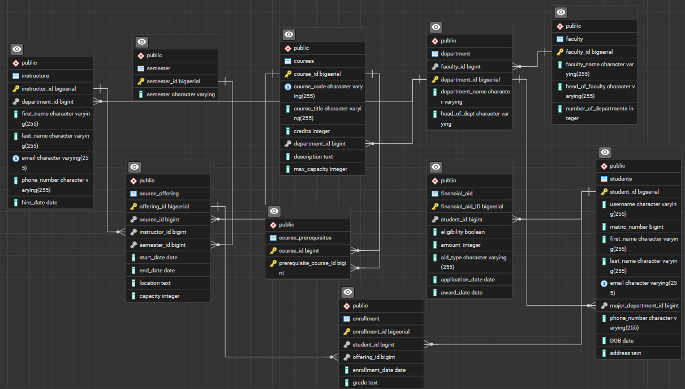

# University Course Registration System Database

## Overview

This project implements a foundational database system for a university course registration platform. It is designed to manage essential entities such as students, instructors, courses, departments, faculties, and enrollment records. The database schema facilitates tracking student academic progress, course offerings, and the relationships between various university entities. This project demonstrates core database design principles, data manipulation techniques, and practical SQL queries using PostgreSQL.

## Database and Tools

* **PostgreSQL:** The robust relational database management system used for the entire project.
* **pgAdmin 4:** The primary graphical administration and development tool used for PostgreSQL, aiding in database design, execution of scripts, and data inspection.

## Database Schema

The database is meticulously structured to efficiently manage university-related data, ensuring data integrity and enabling complex querying. The schema includes the following key tables and their relationships:

* **`faculty`**: Stores information about the university's faculties.
* **`department`**: Details each academic department, linked to a specific faculty.
* **`students`**: Contains personal and academic information for each registered student, linked to their major department.
* **`instructors`**: Holds information about university instructors.
* **`courses`**: Defines the master list of all courses offered by the university.
* **`course_prerequisites`**: A linking table to establish prerequisite relationships between courses.
* **`course_offering`**: Records specific instances of courses being offered in a given semester, linked to an instructor and a base course.
* **`enrollment`**: Tracks student registrations for specific course offerings.
* **`payments`**: Manages payment information related to student enrollments.

For a visual representation of the database structure and relationships, please refer to the Entity-Relationship Diagram (ERD) below:



## SQL Scripts

This project is organized with a set of SQL scripts designed for sequential execution to set up and populate the database:

1. **`1_schema_creation.sql`**:

   * This script is responsible for creating all the tables (`faculty`, `department`, `students`, `instructors`, `courses`, `course_prerequisites`, `course_offering`, `enrollment`, `payments`).
   * It defines primary keys, unique constraints, and all necessary foreign key relationships to ensure referential integrity across the database.
   * `COMMENT ON TABLE` and `COMMENT ON CONSTRAINT` statements are used extensively to provide in-line documentation for clarity.
2. **`2_data_seeding.sql`**:

   * Populates all tables with initial, realistic dummy data. This includes faculties, departments, students, instructors, courses, course offerings, enrollments, and payments.
   * This script is essential for providing a functional dataset for testing and demonstration purposes immediately after schema creation.
3. **`3_dml.sql`**:

   * Contains various Data Manipulation Language (DML) operations and example queries that demonstrate how to interact with the database.
   * **DML Operations:** Includes `INSERT` statements for registering new students, `UPDATE` statements for modifying records (e.g., student grades), and `DELETE` statements for dropping students from courses.
   * **Query Examples:** Showcases how to retrieve specific information, such as:
     * Listing all students enrolled in a particular course.
     * Finding all courses taught by a specific instructor.
     * Calculating the number of students in each department.
     * Identifying courses with available seats.
     * Retrieving student payment history.
     * Joining multiple tables to get comprehensive reports (e.g., student course schedules).

## Key Features & Demonstrated Queries

The project extensively demonstrates the following database functionalities and analytical queries:

* **Core Data Management:** Efficient creation and population of student, instructor, course, and departmental records.
* **Enrollment Management:** Functionality for registering students in courses, dropping courses, and updating enrollment details (e.g., grades).
* **Relationship Management:** Effectively handling one-to-many and many-to-many relationships (e.g., students to enrollments, courses to prerequisites).
* **Reporting Queries:**
  * **Course Enrollment Rosters:** Retrieve lists of all students in a given course offering.
  * **Instructor Workload:** Identify all courses an instructor is teaching.
  * **Departmental Analytics:** Calculate student counts per department.
  * **Resource Management:** Determine course offerings with available capacity.
  * **Financial Tracking:** Query student payment statuses and amounts.
  * **Prerequisite Tracking:** Identify course prerequisites.

## PostgreSQL Concepts Demonstrated

This project is a practical application of several fundamental and advanced PostgreSQL concepts:

* **Data Definition Language (DDL):** `CREATE TABLE`, `ALTER TABLE`, `DROP TABLE`, `COMMENT ON`.
* **Data Manipulation Language (DML):** `INSERT INTO`, `UPDATE`, `DELETE`.
* **Constraints:** `PRIMARY KEY`, `FOREIGN KEY` (with `ON UPDATE CASCADE`, `ON DELETE CASCADE/RESTRICT`), `UNIQUE`, `NOT NULL`, `CHECK`.
* **Relationships:** Implementation of one-to-many and many-to-many relationships through linking tables.
* **Complex JOINs:** Utilizing `INNER JOIN`, `LEFT JOIN` for combining data from multiple tables.
* **Aggregation:** `COUNT` with `GROUP BY` for summarizing data (e.g., student counts).
* **Conditional Logic:** Implicit use of `WHERE` clauses for filtering data.
* **Date/Time Functions:** Usage of `CURRENT_TIMESTAMP` or `NOW()` for default date values.

## Setup and Usage

To set up and interact with this database on your local machine:

1. **Install PostgreSQL and pgAdmin 4:** Ensure you have both PostgreSQL (the database server) and pgAdmin 4 (the management tool) installed.
2. **Clone the Repository:**

   ```bash
   git clone [https://github.com/juto-shogan/your-university-registration-repo.git](https://github.com/juto-shogan/your-university-registration-repo.git)
   cd your-university-registration-repo
   ```

   *(Remember to replace `your-university-registration-repo.git` with your actual repository name)*
3. **Create a New Database:**
   Open pgAdmin 4, connect to your PostgreSQL server, and create a new database (e.g., `university_db`).
4. **Execute SQL Scripts in Order:**
   Open the SQL files in pgAdmin 4 (or use a psql client) and run them in the following sequence:

   * `1_schema_creation.sql`: This will set up all tables and constraints.
   * `2_data_seeding.sql`: This will populate the database with initial dummy data.
   * `3_dml.sql`: This script contains additional data manipulation examples and various queries you can run to explore the database functionalities and retrieve specific information.
5. **Explore and Query:**
   Once the scripts are run, you can use pgAdmin 4's query tool to write and execute your own SQL queries to interact with the database and retrieve desired information.

## Important Notes

* The data used in `2_data_seeding.sql` is **dummy data** for demonstration purposes only.
* The SQL scripts are numbered (`1_`, `2_`, `3_`) to clearly indicate the recommended order of execution for setting up the database from scratch.

## Author

Somto Mbonu

Data Analyst
GitHub Profile: [juto-shogan](https://github.com/juto-shogan)
